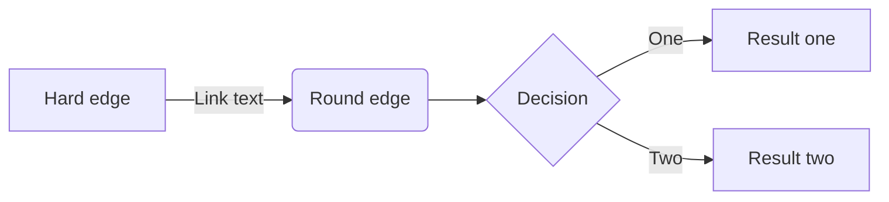
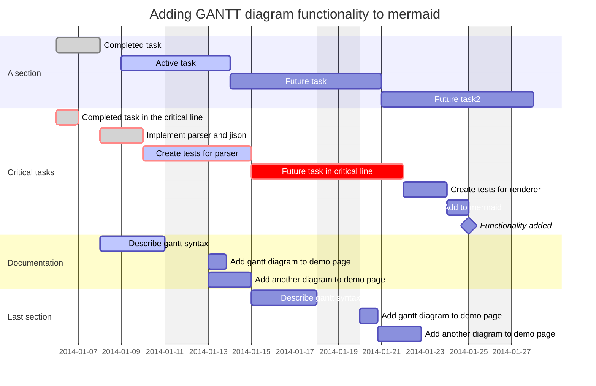

# 关于BlueTex主题

[TOC]

# 文本

这是一段正文内容样式，以下是不同文本样式效果式效果：**这是加粗文本样式**, <u>这是下划线样式</u>, *这是斜体字样式*,  [这是超链接样式：DaYangtuo247/typora-blueTex-theme](https://github.com/DaYangtuo247/typora-blueTex-theme), `This is a single line code style`, ~~这是删除线效果样式~~,==这是文字高亮效果==

# 数学公式

$$
\begin{align}
f(x) &= \lim_{n \to \infty} \left( \sum_{k=1}^n \frac{1}{k^x} \right) + \int_0^1 \frac{\sin(\pi x)}{x^2 + 1} \, dx \\
     &= \begin{cases}
         \displaystyle \sqrt{x^2 + \alpha^2} + \sum_{i=1}^{\infty} \frac{(-1)^i}{i^2}, & \text{if } x > 0 \\
         \displaystyle \int_{-\infty}^{\infty} e^{-t^2} \, dt, & \text{if } x = 0 \\
         \displaystyle \begin{pmatrix}
             \cos x & -\sin x \\
             \sin x & \cos x
         \end{pmatrix} \cdot 
         \begin{pmatrix}
             x \\
             y
         \end{pmatrix}, & \text{if } x < 0
     \end{cases}
\end{align}
$$
# 列表

这些是列表样式效果:


1. 这是有序列表 A
2. 这是有序列表 B

- This is Item 1.
- This is Item 2.
- [x] Something is DONE.
- [ ] Something is DONE.

分割线

----

# 代码

单行代码样式：`python3 build.py build_ext`

大段代码块样式：

```CPP
#include <iostream>
using namespace std;

class SafeIntPointer {
public:
    explicit SafeIntPointer(int v) : m_value(new int(v)), m_used(new int(1)) {}
    ~SafeIntPointer() {
        cout << "~SafeIntPointer" << endl;
        (*m_used)--;  // 引用计数减1
        if (*m_used <= 0) {
            delete m_used;
            delete m_value;
            cout << "real delete resources" << endl;
        }
    }
    SafeIntPointer(const SafeIntPointer& other) {
        m_used = other.m_used;
        m_value = other.m_value;
        (*m_used)++;  // 引用计数加1
    }
    SafeIntPointer& operator=(const SafeIntPointer& other) {
        if (this == &other)  // 避免自我赋值!!
            return *this;

        m_used = other.m_used;
        m_value = other.m_value;
        (*m_used)++;  // 引用计数加1
        return *this;
    }

    int get() { return *m_value; }
    int getRefCount() {
        return *m_used;
    }

private:
    int* m_used;  // 引用计数
    int* m_value;
};
```

# 表格样式

|  标题1  |  标题2  |  标题3  |
| :-----: | :-----: | :-----: |
| 单元格1 | 单元格2 | 单元格3 |
| 单元格1 | 单元格2 | 单元格3 |
| 单元格1 | 单元格2 | 单元格3 |

# 引用

> [!NOTE]
>
> This is a Note text box ......

> [!TIP]
>
> This is a Tip text box ......

> [!IMPORTANT]
>
> This is a Important text box ......
>

> [!WARNING]
>
> This is a Warning text box ......

> [!CAUTION]
>
> This is a Caution text box ......

# 图表





# 一级标题1

## 二级标题2

### 三级标题3

#### 四级标题4
##### 五级标题5

###### 六级标题6
